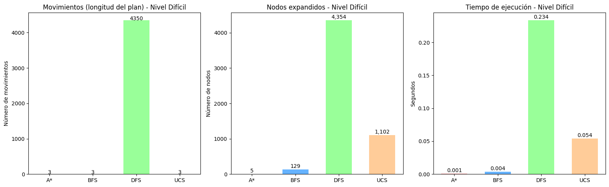

# Proyecto: Fundamentos de Inteligencia Artificial – Comparación de Algoritmos en *Unblock Me*

## Descripción General
Este proyecto fue desarrollado en el marco del curso de **Fundamentos de Inteligencia Artificial** y tiene como objetivo aplicar y comparar algoritmos de búsqueda **no informados** (BFS, DFS y UCS) contra un algoritmo **informado** (A*) en el contexto del juego de rompecabezas **Unblock Me**.

El análisis combina dos enfoques:
- Una implementación en **Python** del juego *Unblock Me* con los algoritmos de búsqueda.
- Un **notebook Jupyter** con experimentos, tablas y gráficos para comparar el desempeño de los algoritmos en términos de **tiempo de ejecución**, **nodos expandidos** y **número de movimientos**.

---

## El Juego *Unblock Me*
*Unblock Me* es un rompecabezas de tablero 6x6 en el que el objetivo es **mover el bloque rojo** hacia la salida situada en el borde derecho.  

Para lograrlo:
- El bloque rojo se desplaza solo de manera horizontal.
- Otros bloques pueden ser horizontales o verticales y se mueven dentro de los límites de la cuadrícula.
- El objetivo se alcanza cuando el bloque rojo llega a la salida.

---

## Archivos del Proyecto
### `UnBlockMe5.py`
Implementa el juego en consola (CLI) e incluye:
- Definición del tablero, bloques y movimientos posibles.
- Implementación de los algoritmos de búsqueda:
  - **BFS** (Breadth-First Search).
  - **DFS** (Depth-First Search).
  - **UCS** (Uniform Cost Search).
  - **A*** (con heurística basada en el número de bloqueadores frente al bloque rojo).
- Visualización del tablero paso a paso.
- Medición de métricas:
  - Nodos expandidos.
  - Tiempo de ejecución.
  - Número de movimientos hasta la meta.

### `UnblockMe_experiments.ipynb`
Notebook en Jupyter utilizado para:
- Ejecutar múltiples experimentos con los algoritmos.
- Generar **tablas comparativas**.
- Visualizar los resultados mediante **gráficos** que muestran diferencias en eficiencia entre algoritmos no informados y A*.

---

## Ejecución
### 1. Juego en consola
Requisitos: Python 3.x  

Ejecutar en terminal:
```bash
python UnBlockMe5.py
```

Flujo de uso:
1. Seleccionar un algoritmo (ASTAR, BFS, DFS o UCS).
2. Escoger la opción de resolver el tablero.
3. Observar la animación del recorrido y métricas del algoritmo.

---

### 2. Notebook de experimentos
Requisitos:  
- Jupyter Notebook  
- Librerías: `pandas`, `matplotlib`, `seaborn`

Ejecutar:
```bash
jupyter notebook UnblockMe_experiments.ipynb
```

Dentro del notebook podrás:
- Ejecutar celdas con distintos algoritmos.
- Comparar rendimiento en tablas.
- Generar gráficos de métricas.

---

## Resultados de comparación

Los experimentos muestran diferencias claras entre algoritmos no informados y A*.  

.png)


- **Movimientos**: DFS genera planes muy largos en comparación con A*, BFS y UCS.  
- **Nodos expandidos**: A* expande significativamente menos que BFS y UCS.  
- **Tiempo de resolución**: A* es el más rápido, mientras que UCS es el más lento debido a su naturaleza exhaustiva.  

---

## Conclusiones
- Los algoritmos **no informados** (BFS, DFS, UCS) presentan limitaciones en eficiencia al no utilizar conocimiento adicional del problema.  
- El algoritmo **informado A*** logra mejores resultados en **tiempo** y **nodos expandidos** gracias a su heurística.  
